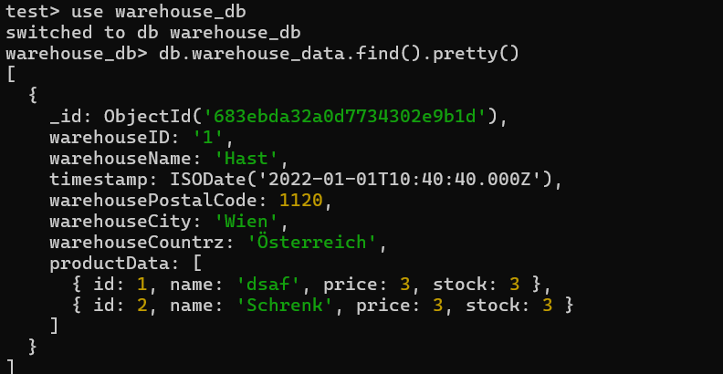

# **Entwicklungsprotokoll Microservice-Shop**

**Projekt:** Microservice-Shop-System  
**Bearbeiter:** Lukas Schrenk

---

### **Schritt 1: Projektstruktur anlegen**
- Vier Verzeichnisse für die Services erstellt: `user_service`, `product_service`, `order_service`, `payment_service`.
- In jedem Verzeichnis ein neues FastAPI-Projekt initialisiert (`main.py` angelegt).

---

### **Schritt 2: User-Service implementieren**
- In `user_service/main.py` das User-Modell mit `username`, `email`, `password` erstellt.
- Dictionary `users_db` für die User-Daten angelegt.
- POST-Endpunkt `/signup` zum Registrieren von Usern programmiert.
- POST-Endpunkt `/login` hinzugefügt, der Username und Passwort prüft.
- Fehlerbehandlung für doppelte User und falsche Logins eingebaut.

---

### **Schritt 3: Product-Service implementieren**
- In `product_service/main.py` das Product-Modell erstellt.
- Dictionary `products_db` für Produktdaten angelegt.
- CRUD-Endpunkte (`/product`, `/product/{id}`) für Produkte programmiert.
- Jinja2-Templates für die Produkt-GUI erstellt.
- `static`-Ordner für CSS angelegt.
- Fehler beim Start wegen fehlendem `static`-Ordner erkannt und durch Anlegen des Ordners behoben.
- Fehler beim Mounten von `static` ohne führenden Slash erkannt und durch Änderung zu `/static` behoben.

---

### **Schritt 4: Authentifizierung für Product-GUI**
- Login-Formular in der GUI erstellt.
- Beim Login POST-Request an User-Service `/login` implementiert.
- Dummy-Email im Login-Request verwendet, da User-Service das Feld verlangt.
- Bei erfolgreichem Login Session-Cookie gesetzt (`session=ok`).
- Alle GUI-Routen prüfen das Session-Cookie, sonst Redirect auf Login.
- Fehlerbehandlung bei Login-Fehlern und User-Service-Timeouts eingebaut.

---

### **Schritt 5: Order-Service implementieren**
- In `order_service/main.py` das Order-Modell mit `order_id`, `product_id`, `quantity` erstellt.
- Dictionary `orders_db` für Bestellungen angelegt.
- CRUD-Endpunkte für Orders programmiert.

---

### **Schritt 6: Payment-Service implementieren**
- In `payment_service/main.py` PaymentRequest- und Payment-Modell erstellt.
- Liste `payments_db` für Zahlungen angelegt.
- POST-Endpunkt `/pay` programmiert:
    - HTTP-Request an Order-Service (`/order/{order_id}`) eingebaut, um Existenz der Order zu prüfen.
    - Fehlerbehandlung für nicht existierende Orders und Verbindungsprobleme eingebaut.
    - Optional: Betrag muss positiv sein, sonst Fehler.
    - Zahlung wird gespeichert, wenn alles passt.
- GET- und DELETE-Endpunkte für Zahlungen ergänzt.

---

### **Schritt 7: Service-Kommunikation testen**
- Alle Services mit Docker Compose gestartet.
- Überprüft, dass alle Services über ihre Service-Namen erreichbar sind (z.B. `http://user_service:8001`).
- Produkt-GUI im Browser getestet: Login, Produkt-CRUD, Logout.
- Mit HTTP-Client (z.B. REST Client) die Endpunkte von Order- und Payment-Service getestet.

---

### **Schritt 8: Fehlerbehebung und Anpassungen**
- Fehler beim Login-Request (fehlende Email) durch Dummy-Email im Product-Service behoben.
- Fehler beim Mounten von `static` durch Korrektur des Pfads und Anlegen des Ordners gelöst.
- Ursprünglicher Versuch, im Payment-Service einen Maximalbetrag zu prüfen, verworfen, da Order kein Preisfeld hat.
- Payment-Service so angepasst, dass nur noch die Existenz der Order und ein positiver Betrag geprüft werden.

---

### **Schritt 9: Endgültige Tests**
- User-Registrierung und Login getestet.
- Produktverwaltung (CRUD) nur mit Login getestet.
- Orders angelegt und abgerufen.
- Zahlungen für existierende und nicht existierende Orders getestet (Fehlerfall geprüft).
- Negative Zahlbeträge getestet (werden abgelehnt).

---

### **Schritt 10: Abschluss**
- Alle Anforderungen wurden umgesetzt.
- Die Microservices funktionieren einzeln und im Zusammenspiel.
- Die Kommunikation über HTTP und Docker Compose läuft stabil.
- Das System ist bereit für weitere Erweiterungen.

---
EKv
---

## **1. Einrichtung Warehouse-Service**
- Neues Verzeichnis `warehouse_service` angelegt.
- FastAPI-Projekt erstellt (`main.py`).
- Dockerfile hinzugefügt und in `docker-compose.yml` eingebunden.
- MongoDB über Docker als persistente Datenbank angebunden.
- Verbindung zur Datenbank mit Motor (async MongoDB Client) hergestellt.
- `warehouse_data`-Collection in `warehouse_db` verwendet.

---

## **2. GUI-Funktionalitäten**
- Templates mit Jinja2 erstellt:
  - `warehouses.html` (Übersicht)
  - `edit_warehouse.html` (Bearbeitung einzelner Lager)
- CSS-Styling über `/static/style.css` implementiert.
- GUI bietet Funktionen:
  - Übersicht aller Lager
  - Lager bearbeiten (Name, PLZ, Ort, Land)
  - Produkt zu Lager hinzufügen (über Produkt-ID)
  - Produkte anzeigen und bearbeiten

---

## **3. Anbindung an `product_service`**
- Produktinformationen werden **nicht in Mongo gespeichert**, sondern bei jedem Request über `product_service` aufgelöst.
- Kommunikation über HTTP (`http://product_service:8002/product/{id}`)
- Fehler bei Erreichbarkeit oder Antwort werden abgefangen.

---

## **4. Produkt hinzufügen / bearbeiten**
- Neues Mapping im Warehouse-Service:
  - `POST /add_product/{warehouse_id}` fügt Produkt ins Lager ein (per ID)
  - `POST /update_product_in_warehouse/{warehouse_id}/{product_id}` bearbeitet Produktdaten direkt per Formular
- Die Formularansicht zeigt pro Produkt Eingabefelder + "Ändern"/"Löschen"-Buttons.
- Änderungen triggern einen POST an den `product_service`.

---

## **5. Authentifizierung zwischen Services**
- Der `product_service` verlangt einen Login für Änderungen.
- Lösung: Passwort und Username im Bearbeitungsformular abfragen.
- Neuer Ablauf:
  - Warehouse-Service sendet Login-Request an `user_service`.
  - Session-Cookie wird entnommen und für den eigentlichen Update-Request mitgesendet.
  - Funktioniert auch über interne Kommunikation dank Docker-Network (`http://user_service:8001/login`)

---

## **6. Fehlerbehandlung / Logging**
- Fehlerhafte Produkt-IDs, fehlende Felder und HTTP-Fehler werden sauber geloggt.
- Beispiel: 422 bei fehlenden Auth-Feldern, 404 bei unbekannter Produkt-ID.
- Statuscodes und Response-Text werden in der Konsole ausgegeben.

---

## **7. Datenbankzugriff (MongoDB)**
- Kein GUI-Zugriff gewünscht → Zugriff über CLI:
```bash
docker exec -it mongodb mongosh
use warehouse_db
db.warehouse_data.find().pretty()
```


# Befehle

```
docker-compose up --build
docker-compose down -v
```

# Quellen

https://kinsta.com/blog/python-microservices/ , 03/06/2025

https://realpython.com/crud-operations/ , 03/06/2025

https://www.w3schools.com/python/python_mongodb_getstarted.asp , 03/06/2025

https://www.mongodb.com/docs/drivers/motor/ , 03/06/2025
